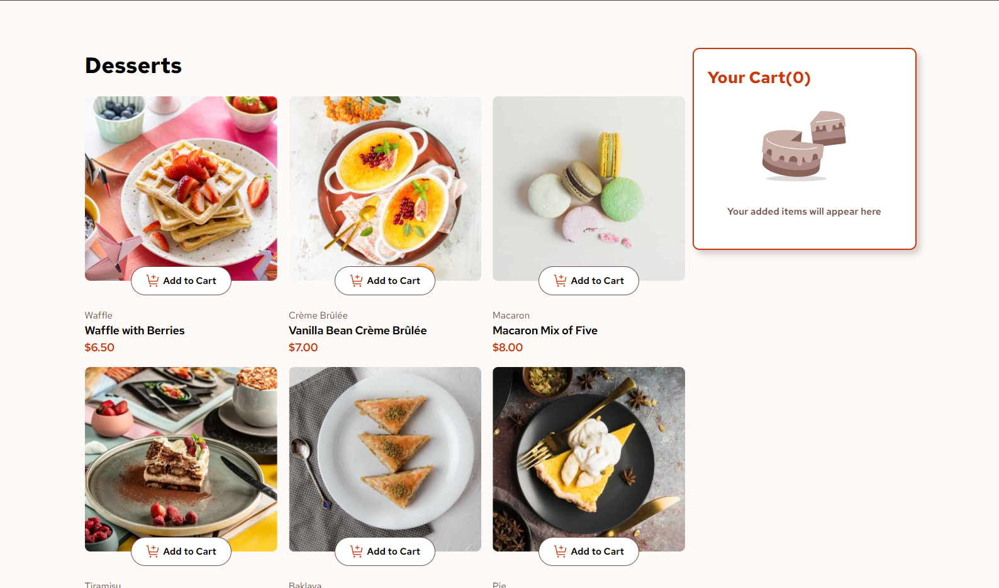
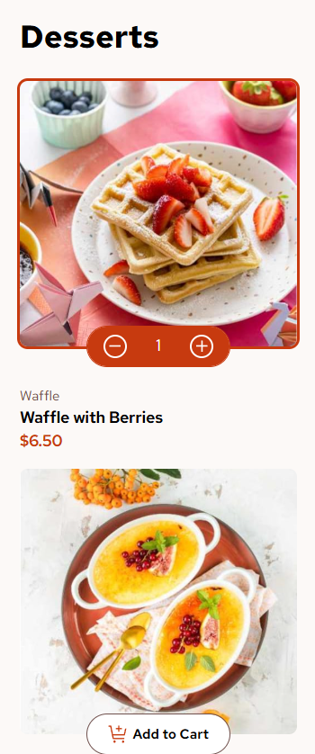

# Product Cart

A React app that features displays products that users can add to their cart. Users can also change the quantity of each individual item as well as remove items from their cart. Also features a confirmation modal. Built as solution to a [FrontendMentor Challenge](https://www.frontendmentor.io/challenges/product-list-with-cart-5MmqLVAp_d).

### Built with:

   

### Deployment

https://ang-riv.github.io/product-cart/

## Introduction

Product Cart displays products and allows users to add them to their cart then place an order. Built to work with the provided dessert data, but can work with different items as well, not just food.

## Features

- **Quantity Adjustment:** users can add as much as they want of one item using the quantity buttons that appear once the item is added to the cart.
- **Visible Selection:** users can see immediately what items have been added to cart due to a border appearing around that item.
- **Confirmation Modal:** after placing an order, a modal appears to reset to make a new order and to summarize everything in the order.

## Challenges

- **Problem**: After deploying, images/icons wouldn't load.
  - **Solution**: Instead of importing images, added them all to public which is messed up the file paths. Added: import.meta.env.BASE_URL to file paths to fix it.
- **Problem**: Couldn't change the color of svgs to the on hover.
  - **Solution**: First tried to make it into a mask with MaskKit on a button, but got really complicated. Instead just added a separate svg with the hover color and render the correct icon on hover with states.
